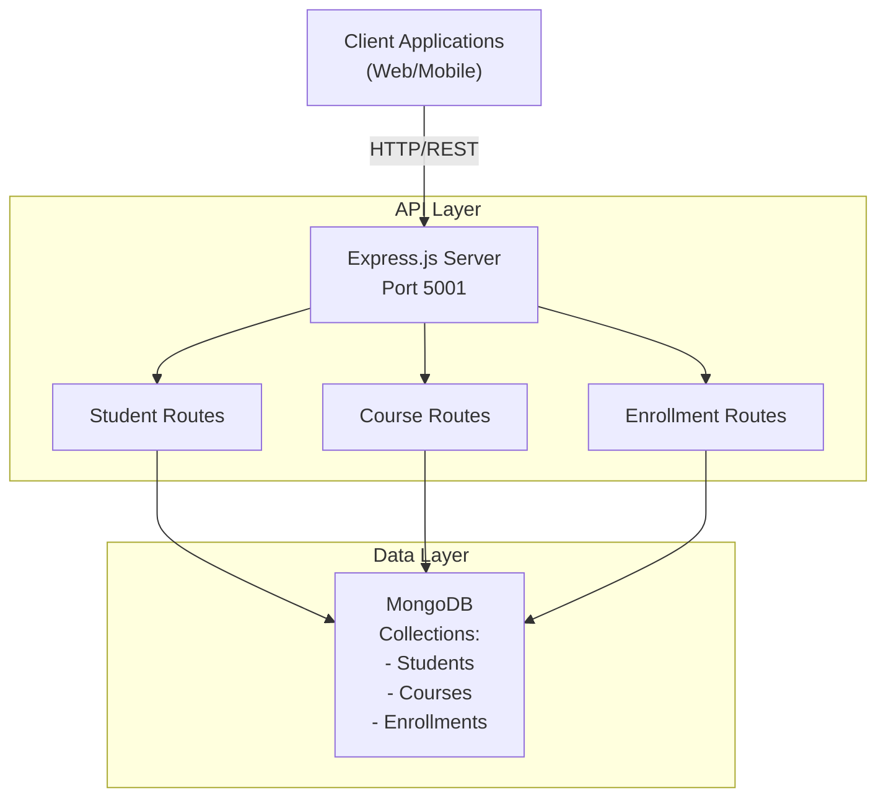
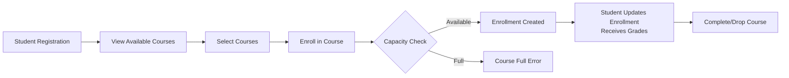

# CampusConnect - Architecture

## System Overview

CampusConnect is a comprehensive student management and enrollment system for academic institutions.



## 3-Tier Architecture

### Presentation Tier
- Web and mobile interfaces for students, instructors, and administrators
- Health check monitoring endpoint

### Application Tier
- **Express.js Server**: Handles all business logic
- **Student Management**: Create, read, update, delete student records
- **Course Management**: Manage course catalog and capacity
- **Enrollment System**: Enroll students in courses with validation
- **Request Validation**: Joi schema validation
- **Error Handling**: Comprehensive error handling middleware

### Data Tier
- **MongoDB**: NoSQL database with collections for:
  - Students (50+)
  - Courses (15+)
  - Enrollments (100+)

## Database Collections

### Students Collection
```json
{
  "studentId": "STU-1001",
  "firstName": "string",
  "lastName": "string",
  "email": "string@campus.edu",
  "phone": "string",
  "department": "Computer Science | Electronics | Mechanical | Civil | Electrical",
  "gpa": 3.5,
  "semester": 3,
  "status": "active | inactive | graduated | suspended",
  "enrolledCourses": [ObjectId],
  "admissionDate": Date
}
```

### Courses Collection
```json
{
  "courseId": "COURSE-1001",
  "courseName": "Data Structures",
  "courseCode": "CS201",
  "credits": 3,
  "department": "Computer Science",
  "capacity": 50,
  "enrolledStudents": 45,
  "semester": 2,
  "instructor": {
    "name": "Prof. Name",
    "email": "prof@campus.edu"
  },
  "schedule": {
    "days": ["Monday", "Wednesday"],
    "startTime": "09:00",
    "endTime": "10:30",
    "location": "Room 101"
  },
  "status": "active | archived | cancelled"
}
```

### Enrollments Collection
```json
{
  "enrollmentId": "ENR-1001",
  "studentId": ObjectId,
  "courseId": ObjectId,
  "semester": 2,
  "grade": "A | B | C | D | F | Pending",
  "gradePoints": 4.0,
  "status": "enrolled | completed | dropped | failed",
  "attendance": 85,
  "testScores": [
    {
      "testName": "Midterm",
      "score": 85,
      "maxScore": 100
    }
  ],
  "assignmentScores": [...]
}
```

## API Endpoints

### Students
- `POST /api/students` - Register new student
- `GET /api/students` - List students (with filters)
- `GET /api/students/:id` - Get student profile
- `PUT /api/students/:id` - Update student information
- `DELETE /api/students/:id` - Deactivate student

### Courses
- `POST /api/courses` - Create course
- `GET /api/courses` - List courses
- `GET /api/courses/:id` - Get course details
- `PUT /api/courses/:id` - Update course
- `DELETE /api/courses/:id` - Archive course

### Enrollments
- `POST /api/enrollments` - Enroll student in course
- `GET /api/enrollments` - List all enrollments
- `GET /api/enrollments/:studentId` - Get student's enrollments
- `PATCH /api/enrollments/:id` - Update grades/status

### Health
- `GET /health` - API health status

## Student Enrollment Flow



## Key Features

1. **Capacity Management**: Tracks course capacity and enrolled students
2. **Grade Tracking**: Records grades, test scores, and assignments
3. **Attendance Monitoring**: Tracks attendance percentages
4. **Department Management**: Organize students by departments
5. **Semester Tracking**: Manages multi-semester enrollment
6. **Prerequisites**: Stores prerequisite requirements

## Database Indexes

- Students: `email` (unique), `department`, `status`
- Courses: `courseCode` (unique), `department`, `semester`
- Enrollments: `(studentId, courseId)` (unique), `status`, `semester`

## Technology Stack

- **Runtime**: Node.js 16+
- **Framework**: Express.js 4.18
- **Database**: MongoDB 5.0+
- **Validation**: Joi
- **Testing**: Jest, Supertest
- **API Format**: RESTful JSON

## Scalability

1. Database indexing for fast queries
2. Pagination support on all list endpoints
3. Stateless API design for horizontal scaling
4. Can add Redis caching for frequently accessed data
5. Ready for database sharding by semester or department

## Error Handling

- Duplicate key errors (11000)
- Validation errors (400)
- Not found errors (404)
- Server errors (500)
- Course capacity validation
- Course completion workflow
